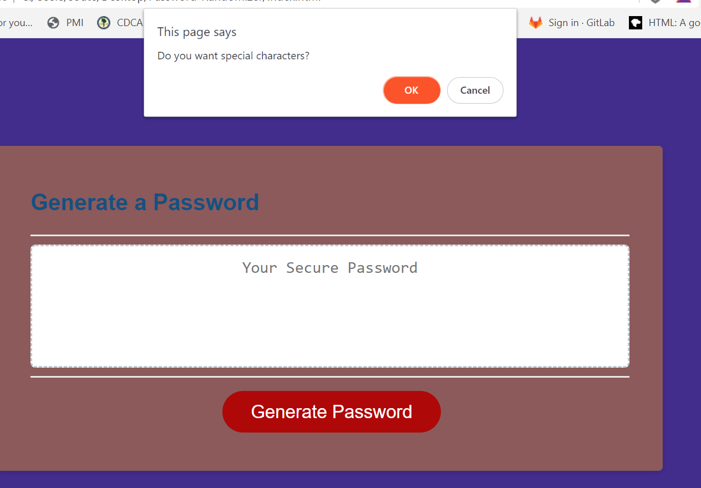
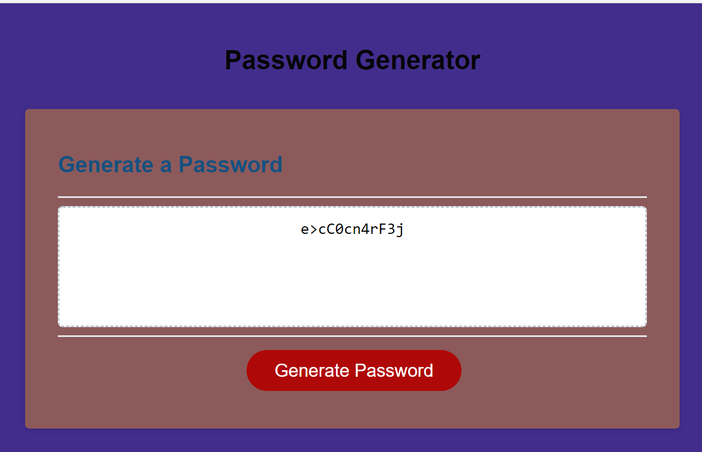

Password Randomizer

Summary:

This is a front end application designed to allow a user to receive a secure password upon request. Once the end user click the generate button, they are prompted for inputs such as preffered length, and what character types to include. Then the end user is to receive a secure password displayed in the window.

Starter Code:
// Assignment Code
var generateBtn = document.querySelector("#generate");

// Write password to the #password input
function writePassword() {
  var password = generatePassword();
  var passwordText = document.querySelector("#password");

  passwordText.value = password;

}

// Add event listener to generate button
generateBtn.addEventListener("click", writePassword);

Steps Taken

Step 1: User is prompted to enter in desired password lenght, which is stored as a variable "length"
      
Code:
        
        
        
        var length = +window.prompt("Please enter a number between 8 and 256 to select your password length");
        if (length < 257 && length > 7) {
            userSelection();

        } else {
            window.alert("Please enter a number between 8 and 256")
        }

Step 2: User is asked to confirm whether they wish to include Lowercase, Uppercase, Numbers, and Symbols in their password. This is used to build out the string named characters.

Code:
        
        function userSelection() {

            var wantLow = window.confirm("Do you want lowercase letters?")

            //Confirm User Criteria 
            var wantNum = window.confirm("Do you want numbers?")

            //Confirm User Criteria 
            var wantChar = window.confirm("Do you want special characters?")

            //Confirm User Criteria 
            var wantUp = window.confirm("Do you want uppercase letters?")
            //Added to Character string if true
            if (wantLow === true) {
                characters += lowerCase
            };
            //Added to Character string if true
            if (wantUp === true) {
                characters += upperCase
            };
            //Added to Character string if true
            if (wantNum === true) {
                characters += numbers
            };
            //Added to Character string if true
            if (wantChar === true) {
                characters += symbols
            };
        }
Step 3: A for loop is run to return a random character from the string.

Code:

        var display =''
        for (var i=0;i < length; i++){   
            display += characters.charAt(Math.floor(Math.random() * characters.length));
            console.log(display) 
        }

URL here: https://lelandcypress.github.io/Password-Randomizer/